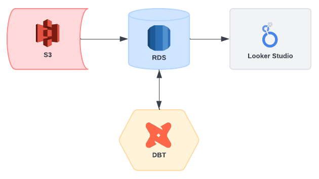

# F1 ETL Pipeline 🏎️

Designed and orchestrated an ETL pipeline for F1 data.

### [View Dashboard (INP)](https://github.com/rahulsingh34/f1-etl)

### DAG Overview
- Get CSVs from S3 bucket
- Process the files using Pandas and push them to RDS
- Run DBT model(s)

### Pipeline Diagram

### Tools & Technologies
- Docker
- Airflow
- AWS (S3 + RDS PostgreSQL)
- DBT
- Looker Studio
