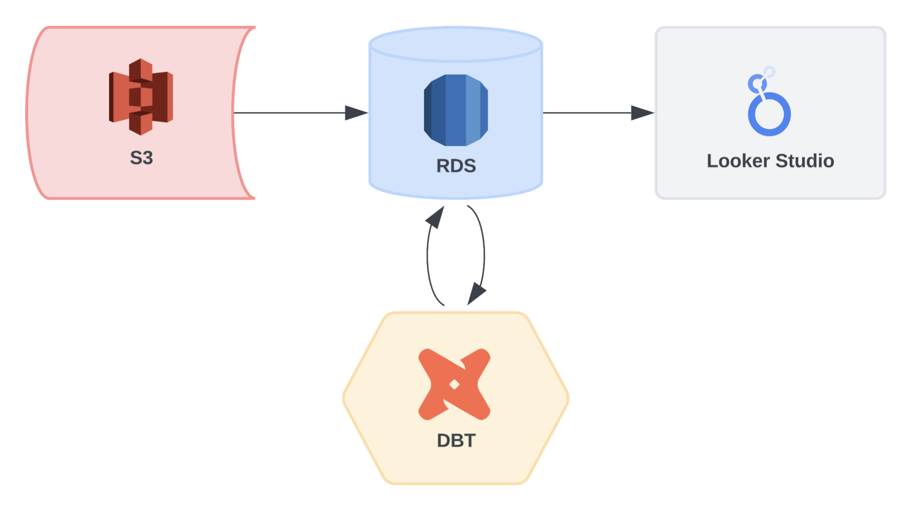

# F1 ETL Pipeline 🏎️

Designed and orchestrated a batch ETL pipeline for F1 data.

### [View Dashboard](https://lookerstudio.google.com/u/2/reporting/726a8752-3a0c-45a2-9064-f091a137e920/page/FRM4D)

### Overview
- Get CSVs from S3 bucket
- Process the files using Pandas and push them to RDS
- Run DBT model(s)
- Use data model to create dashboard in Looker Studio

### Diagram

### Tools & Technologies
- Docker
- Airflow
- AWS (S3 + RDS PostgreSQL)
- DBT
- Looker Studio
